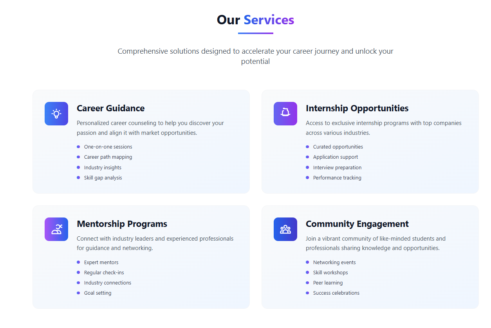

This is the landing page for Beyond Career, an IIT Kharagpur startup, which helps students grow in their careers.
Built with React.js and Tailwind CSS.

Core Features -
1. Modern Hero Section - added a headline, call-to-action buttons, and a visually appealing animation in the background.
2. About Section - added the company’s mission and vision, founding story, and presented core values: Innovation, Excellence, and Community.
3. Services Section - added subsections like Career Guidance, Internship Opportunities, Mentorship Programs, and Community Engagement.
4. Testimonials Section - added success stories of 5 students in a single-item carousel. Also added relevant statistics and achievements: Job placement rate, average salary increase, and rating.
5. Contact Section - added a contact form which logs the information to the browser console, and added the company’s contact information like phone number, email, and address.
6. Navigation - added a navbar which supports smooth scrolling between sections, and also added a hamburger menu which is mobile-friendly.

Tech Stack - React.js with Vite configuration, Tailwind CSS, Deployed on Vercel

GitHub Link - https://github.com/yagnitM/beyond-career.git
Vercel Link - https://beyond-career.vercel.app

# Design Rationale
I designed the Beyond Career landing page by maintaining a blue-purple color theme for a professional look. I created separate sections for all relevant components: Hero, About, Services, Testimonials, Contact and rendered them in Home component in a single-page layout. I designed the logo using Canva, with an upward arrow symbolizing growth for students in their careers.

# Technical Docs
I chose React.js and Tailwind CSS tech stack for modern UI components. I maintained clean code by separating each section in different JSX components. Ensured smooth scrolling from Navbar to sections and added Social Media handles in Contact section, which redirects to corresponding social media page.

# Deployment Guide
I pushed the frontend folder to a public GitHub repository. Imported the repo to Vercel, which deploys the landing page automatically on every commit. The landing page does not support backend right now.

# Credits
- Used images from Pexels for Testimonial sections.

